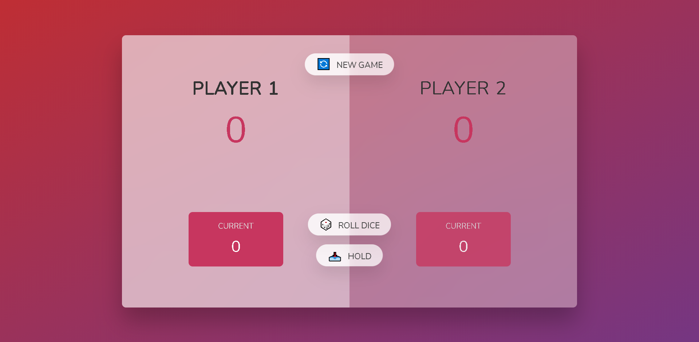

# Dice Rolling Game
- A Cool & Fun Game Based on Dice Rolling
- More detail in game description section

## Table of contents

- [Overview](#overview)
  - [Screenshot](#screenshot)
  - [Links](#links)
- [My process](#my-process)
  - [Built with](#built-with)
- [Game Description](#game-description)
- [Author](#author)

## Overview

### Screenshot

### Links

- Live Site URL: [GitHub Pages](https://frontendparham.github.io/DiceGame/)

## My process

### Built with

- HTML
- CSS
- JavaScript

## Game Description

- داخل این بازی سرگرم کننده شما به نوبت تاس میریزید و به اندازه اون تاس به امتیاز لحظه ایتون اضافه میشه و اگه میتونید اون امتیاز رو به امتیاز کلیتون اضافه کنید چون اگر 1 بیارید تمام امتیاز های لحظه ایتون میپره ئ نوبت به بازیکن مقابل میرسه
- بازیکنی برنده است که زودتر مجموع امتیازاتش به 100 برسه

## Author

- Parham Tavakolian
- Instagram - [@frontendparham](https://www.instagram.com/frontendparham)
- GitHub - [@frontendparham](https://www.github.com/frontendparham)
